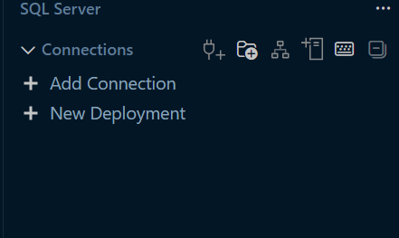
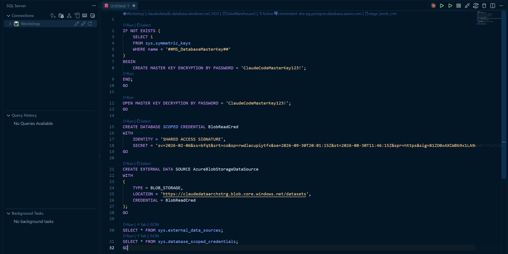

# Workshop 1 · Part 2 - Connect Your Data Sources

*Distribute the `.env`, wire up SQL Server + Blob Storage, and confirm Kafka is streaming.*

**[Part 1](./workshop1-part1-prerequisites.md) · Part 2 · [Part 3](./workshop1-part3-security-check.md)**

---

#### 1. Distribute the `.env`

1. Get the `.env` file from the WhatsApp group and change your database to the number allocated to you, if you are allocated 11,the database should be DataWarehouse11
2. Copy it into all 4 workshop folders: `workshop1`, `workshop2`, `workshop3`, `workshop4`

> [!IMPORTANT]
> Everyone gets the same `.env` from the group. Do not commit it, do not rename it.

---

#### 2. Connect Blob Storage via the SQL Server extension

1. Click **Add Connection**

   

2. Give it a **Profile Name**
3. Click **Load from Connection String**
4. Paste the connection string value from `.env` (the `sqlconection` key)
5. Open `blobconnector.sql` and run the query

   

6. Run `schemacreate.sql`

```sql
-- run in order, in the SQL Server extension
-- 1. blobconnector.sql
-- 2. schemacreate.sql
```

---

#### 3. Verify Kafka streaming

1. Confirm `.env` is in place, then install dependencies:
2. In the VS Code terminal, navigate to the `workshop1` folder

   ```bash
   npm install
   ```

3. In the VS Code terminal, navigate to the `workshop1` folder
4. Run the connectivity check:

   ```
   node kafkacheck.js                  # fresh random group
   node kafkacheck.js --group my-name  # test stable group
   node kafkacheck.js --timeout 20000  # slow network
   ```

> [!NOTE]
> Look for `=== SUCCESS: Kafka connection, auth, topic, and group-join all verified ===` in the output. Anything else means broker, auth, or topic config needs fixing before you move on.

---

**Next: [Part 3 - Run the Security Check on Dataset](./workshop1-part3-security-check.md)**
