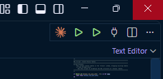

# Workshop 2 · Part 1 - Setup Bronze Layer: ERP and CRM Datasource

*Load the ERP and CRM source data into the Bronze layer.*

**Part 1 · [Part 2](./workshop2-part2-kafka-streaming.md) · [Part 3](./workshop2-part3-silver-layer.md) · [Part 4](./workshop2-part4-star-schema.md)**

---

1. Navigate to the `workshop2` folder
2. Open the VS Code SQL Server extension connection from Workshop 2, make sure it is connected
3. Open `ddl_bronze.sql` and use the run button in the top right corner of the SQL Server extension to load it

   

4. Open `loadbronze.sql` and use the run button in the top right corner of the SQL Server extension to run it

---

**Next: [Part 2 - Setup Bronze Layer: Kafka Streaming](./workshop2-part2-kafka-streaming.md)**
